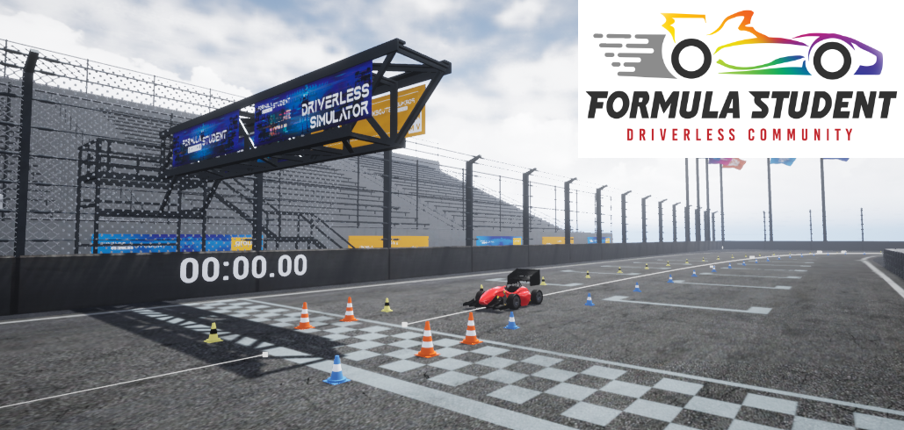

# Formula Student Driverless Simulation

## [Documentation](https://fs-driverless.github.io/Formula-Student-Driverless-Simulator/) / [System overview](/docs/system-overview.md) / [Getting started guide](/docs/getting-started.md) / [Chat](https://gitter.im/FS-Driverless/Formula-Student-Driverless-Simulator)

This is a Formula Student Driverless Simulator (FSDS).
FSDS is a community project with the goal to provide an end-to-end simulation for FS Driverless teams. 
It simulates all commonly used sensors and is compatible with ROS. 
This project has proven itsself during [FS-Online 2020](https://formulastudentonline.com/) where 4 driverless teams competed.
See [day 1](https://www.youtube.com/watch?v=TCgKwuLo3Eo), [day 2](https://www.youtube.com/watch?v=A-RHuWMZbig) and [day 3](https://www.youtube.com/watch?v=1RwY1cNMqMg).

**Problems?** Ask questions in [Gitter chat](https://gitter.im/FS-Driverless/Formula-Student-Driverless-Simulator) or [open an issue](https://github.com/FS-Driverless/Formula-Student-Driverless-Simulator/issues).

FSDS has been originally developed by your friends at [Formula Student Team Delft](https://www.fsteamdelft.nl/), [MIT Driverless](http://driverless.mit.edu/) and [FSEast](https://fseast.eu).

## Repo Overview

`/UE4Project` is the Unreal Engine 4 project.
In here you will find everything that runs inside Unreal Engine.
This includes the world, all assets and the AirSim server.
The AirSim server uses the AirLib shared code (see `/AirSim/AirLib`).

`/ros` is a ROS workspace that contains the `fsds_ros_bridge`. 
This node can connect 1 autonomous system with the simulated world.

`/python` is a python client to connect with the simulator.

`/AirSim` is a slimmed-down, hard-fork of the [AirSim](https://github.com/microsoft/AirSim) project.
There is only C++ code located that is shared between ros-bridge and Unreal Engine.
When AirSim is compiled, the AirLib binaries are placed within `/UE4Project/Plugins/AirSim/Source/AirLib`.

`/operator` is a python project that offers a web GUI for officials to control the simulation, stores lap times and chooses what car is currently connected to the world.
It launches the fsds_ros_bridge to connect an autonomous system to the Unreal world and stops the bridge when the autonomous system is no longer allowed to control the car.

This repo uses LFS for some large files. All files bigger than 90MB are added to LFS.

## Credits
This project is based on the work of some amazing open-source projects. 

Primarily, [the AirSim project built by Microsoft and many open-source contributors](https://github.com/microsoft/AirSim). 
Without it, we could have never done this.

Many game assets like the surrounding world are based on assets from the [Formula Student Technion Driverless AirSim fork](https://github.com/FSTDriverless/AirSim). 
These assets made this project look as cool as it does now.

## License

Copyright (C) 2020 Formula Driverless Competition Simulator Contributors

This program is free software; you can redistribute it and/or modify
it under the terms of the GNU General Public License as published by
the Free Software Foundation; either version 2 of the License, or
(at your option) any later version.

This program is distributed in the hope that it will be useful,
but WITHOUT ANY WARRANTY; without even the implied warranty of
MERCHANTABILITY or FITNESS FOR A PARTICULAR PURPOSE.  See the
GNU General Public License for more details.

You should have received a copy of the GNU General Public License along
with this program; if not, write to the Free Software Foundation, Inc.,
51 Franklin Street, Fifth Floor, Boston, MA 02110-1301 USA.
