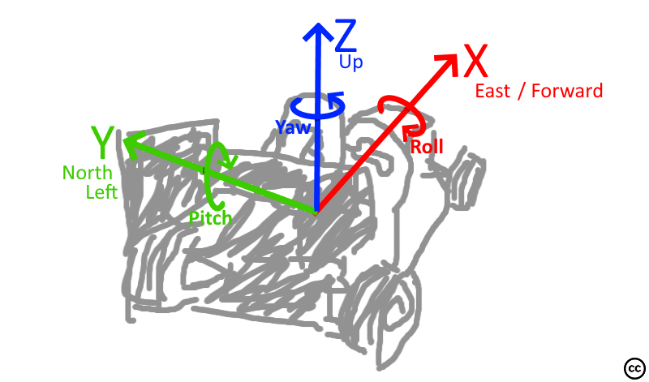

# Coordinate frames & rotation

The simulator coordinates in the **ENU coordinate system** (x = east, y = north, z = up) where **x is pointing forward**.
All **rotations are right-handed**. Yaw is zero when pointing forward/east.

If possible, we stick to the above descirbed coordinate system.
This system was chosen as it seems to be the the default for (autonomous) driving ([1](https://en.wikipedia.org/wiki/Axes_conventions), [2](https://www.mathworks.com/help/driving/ug/coordinate-systems.html)) and it is (the default for ROS)[https://www.ros.org/reps/rep-0103.html].

All data in global frame, that is all things not relative to the vehicle like position of the car odometry or cone positions, are relative to the starting position of the car.
For example, if the car spawned facing east and moved forward 1 meter and 0.5 meter right, it ends up at global position X=1;Y=-0.5;Z=0.

## Unreal Engine

*This information is only relevant for developers of this project*

Unreal Engine uses a different coordinate system:

* x = forward = north
* y = right = east
* z = up
* roll = right handed around the x axis
* pitch = right handed around the y axis
* yaw = left handed around the z axis

Translations between UU and ENU are coded in `CoordFrameTransformer.h`.

