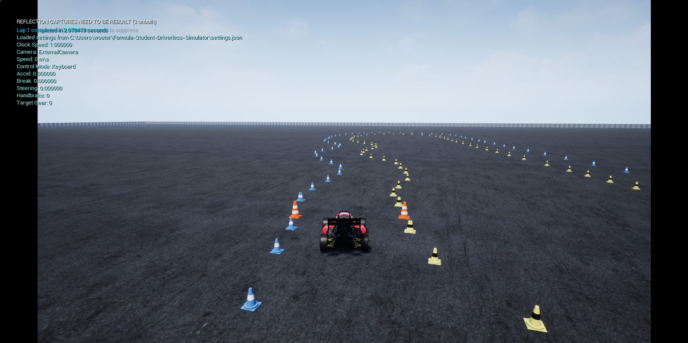

# Custom Mapping

## Format
The maps need to be made in a specific format. We chose to use csv files.
The format within the csv files will have to look as follows:

```
tag,x,y,direction,x_variance,y_variance,xy_covariance
```

for now the `x_variance`, `y_variance` and `xy_covariance` are not used and can be 0.

Possible tags are:
- blue
- yellow
- big_orange

As an example, your file could look something like this:
```
blue,47.96037109,83.400,0.0,0.01,0.01,0.0
yellow,67.96037109,83.400,0.0,0.01,0.01,0.0
big_orange,20.9,-13.8,0.0,0.01,0.01,0.0
big_orange,16.4,-21.6,0.0,0.01,0.01,0.0
big_orange,20.0,-13.3,0.0,0.01,0.01,0.0
big_orange,15.5,-21.1,0.0,0.01,0.01,0.0
blue,1.0,0.0,0.0,0.01,0.01,0.0
yellow,2.0,0.0,0.0,0.01,0.01,0.0
blue,3.0,0.0,0.0,0.01,0.01,0.0
yellow,4.0,0.0,0.0,0.01,0.01,0.0
blue,5.0,0.0,0.0,0.01,0.01,0.0
yellow,6.0,0.0,0.0,0.01,0.01,0.0
```

It is important to either have 4 or 2 big orange cones to make sure that we can calculate how the start finish line should be oriented.

## Loading it in the simulator
Open the simulator and select custom map. A text field will show up, paste the absolute path to your map and run the simulator.

To load a new map, restart the simulator and give it a new absolute path to the new map.

## Share it with the community
You can share your maps with the community by adding them to the `maps` folder and creating a pull request.