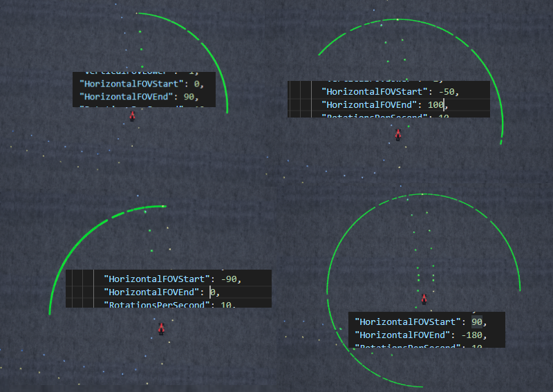

# Lidar


## Adding a lidar to the vehicle.

The lidar sensors are configured in the setting.json.
This is an example lidar:

```
"Lidar1": {
    "SensorType": 6,
    "Enabled": true,
    "X": 0, "Y": 0, "Z": -1,
    "Roll": 0, "Pitch": 0, "Yaw" : 0,
    "NumberOfLasers": 7,
    "PointsPerScan": 2000,
    "RotationsPerSecond": 20,
    "VerticalFOVUpper": 0,
    "VerticalFOVLower": -25,
    "HorizontalFOVStart": 0,
    "HorizontalFOVEnd": 90,
    "DrawDebugPoints": false
}
```

`Lidar1` is the name of the lidar. 
This name will be used to reference the camera when collecing the latest pointcloud.

`X`, `Y` and `Z` are the position of the lidar relative the [vehicle pawn center](vehicle_model.md) of the car in NED frame.

`Roll`,`Pitch` and `Yaw` are rotations in degrees.

`NumberOfLasers` is the - duh - the number of lasers in the lidar.
The lasers are stacked vertically and rotate on the horizontal plane. 
The lasers are distributed equally to cover the specified vertical field of view.
Each laser has a range of 100 meters.

The vertical field of view is specified by choosing the upper (`VerticalFOVUpper`) and lower (`VerticalFOVLower`) limit in degrees. 
The lower limit specifies the vertical angle between the horizontal plane of the lidar and the most bottom laser. 
The upper limit specifies the vertical angle between the horizontal plane of the lidar and most upper laser. 

The horizontal field of view of the lidar is specified with an upper (`HorizontalFOVStart`) and lower (`HorizontalFOVEnd`) limit in degree as well.
The lower limit specifies the counterclockwise angle on a top view (negative yaw) from the direction the lidar is pointing towards.
The upper limit specifies the clockwise angle on a top view (positive yaw) from the direction the lidar is pointing towards.

The following image shows how the horizontal field of view start and end behave:


`RotationsPerSecond` specifies how fast the lasers spins and how often a pointcloud is captured.
There might be slight variations in the actual lidar frequency vs the configured rotation frequency.

`PointsPerScan` is the number of firings per scan within the field of view.
If all lasers hit, the returned pointcloud will contain this number of points in each pointcloud.

`DrawDebugPoints` enables visualization of the lidar hits inside the unreal engine game.
This is known to impact performance quite a bit. 
it is recommended to to only use this during debugging.

## Python

```python
lidardata = client.getLidarData(self, lidar_name = '', vehicle_name = 'FSCar')
```
Calls the simulator API to retrieve the Lidar data.
The API returns a pointcloud as a flat array of floats along with the timestamp of the capture and lidar pose.
Lasers without a hit, shot into the air or too far away, are not included in the pointcloud.
Every floats point represent [x, y, z] coordinate for each point hit within the range in the last scan, relative to the location of the lidar in meters.

Args

* lidar_name (str, optional): Name of Lidar to get data from, specified in settings.json. With no name provided selects the last lidar in the settings.json.
* vehicle_name (str, optional): Name of vehicle to which the sensor corresponds to, by default FSCar.

Returns

* point_cloud (array of float): The points in the pointcloud.
* time_stamp (np.uint64): nanosecond timestamp of when the gps position was captured
* pose (Pose): position (Vector3r) and orientation (Quaternionr) of the location of the lidar at the moment of capture in global reference frame

To convert the flat list of float points into a list of xyz coordinates, you can use the following example function:
```python
def parse_lidarData(self, point_cloud):
    """
    Takes an array of float points and converts it into an array with 3-item arrays representing x, y and z
    """
    points = numpy.array(point_cloud, dtype=numpy.dtype('f4'))
    return numpy.reshape(points, (int(points.shape[0]/3), 3))

points = parse_lidarData(lidardata.point_cloud)
print("point 0  X: %f  Y: %f  Z: %f" % (points[0][0], points[0][1], points[0][2]))
```

Full example [here](https://github.com/FS-Driverless/Formula-Student-Driverless-Simulator/tree/master/python/examples/lidar.py).
