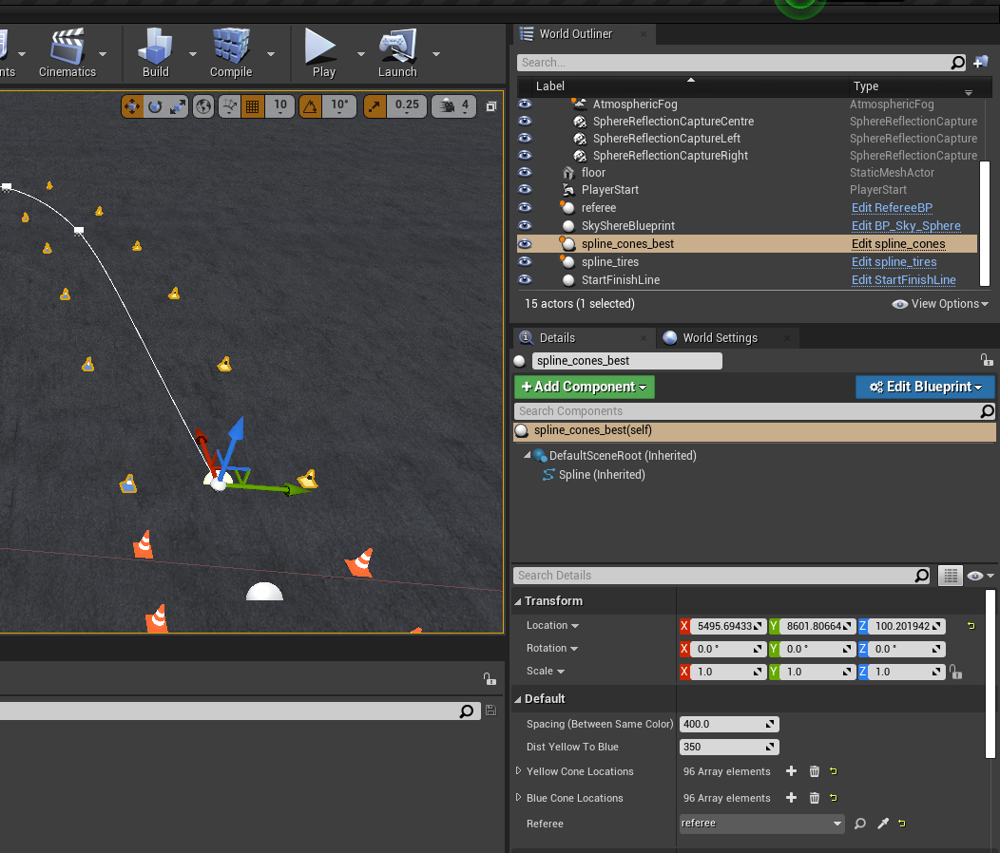
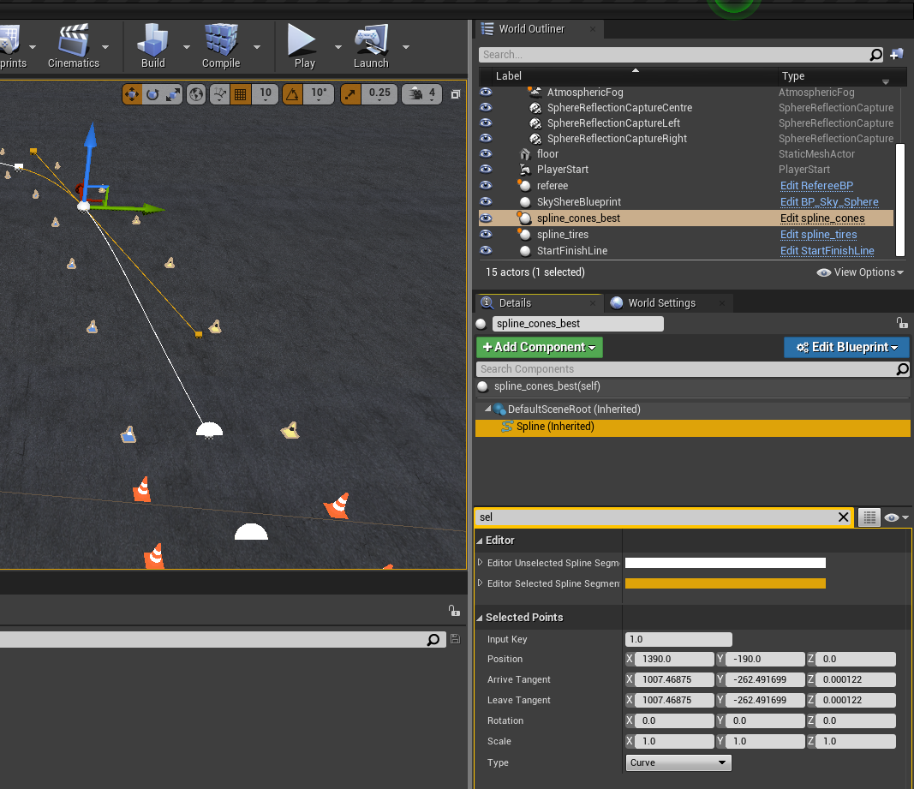
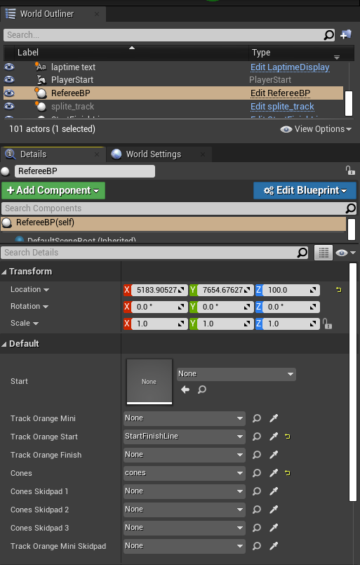

# FSDS Map Building Tutorial
**Before attempting this, take a look at [our custom mapping page](custom-mapping.md)**

Building new maps for FSDS is very useful to test your Autonomous System under various conditions. Creating a map requires using AirSim and Unreal Engine Editor from the FSDS source code. Instructions to install these can be found [here](getting-started.md).

The simplest way to get started is to copy and paste an existing map and modify it to your needs. The simple trainning map with no added decorations can be found [here](https://github.com/FS-Driverless/Formula-Student-Driverless-Simulator/blob/master/UE4Project/Content/TrainingMap.umap). The base map used in competition can be found [this folder](https://github.com/FS-Driverless/Formula-Student-Driverless-Simulator/tree/master/UE4Project/Content/Competition) along with the maps used in the 2020 FSOnline competition which all include decorations.

All assets required and used by other maps can be found in the the `UE4Project/Content` folder found [here](https://github.com/FS-Driverless/Formula-Student-Driverless-Simulator/tree/master/UE4Project/Content). Once an asset is placed in the map, it is then called an actor.

All transforms are done using Unreal Units (uu) which relate to real metric units through the `World to Meters` value from the `World Settings`. All maps use a value of 100 meaning 1 uu = 1cm (or 100 uu = 1m).
## Placing Cones
<!-- How to set the track (cones) -->

### Start/Finish Line
The `StartFinishLine` asset as it's name suggests implements a start and finish line in one. The asset can be found under `Content/FormulaStudentAssets`. The asset blueprints start a lap timer when the car first drives over a colision box within the asset. All other following colisions with that box stops the current lap timer, and starts a new one.

Placing the Start/Finish line is as simple as dragging it from the content browser into the editor. You can move it around with your mouse using the translation axis with the actor selected in the `World Outliner`. Or enter in transform values in the actor's Details. 

You must then make sure that the added asset is linked to the referee for the map. The referee must also have it's values updated. See the Referee section for details.

If any static object is in contact with the collision detection box, it will start the timer before you have first driven over it. To fix this, you can update the "Spline Cones Center" variable string to match the string of the actor colliding with the box. This is primarily used for the skidpad tracks, where cones exist on the collision boundary.

### Cone Splines
The cone splines assets can be found in `Content/RaceCourse/Model/Splines`. There is a `spline_cones` asset used for placing blue and yellow cones or `spline_cones_mini_orange` used for small orange cones.

You can place a cone spline by dragging it from the content browser into the editor. Moving the main translation axis or editing the transform of the `self` value of the actor's details will move the entire cone spline. To edit individual positions of the spline points, click on a spline point, then under the `Spline (Inherited)` details of the actor, the `Selected Points` will allow you to edit the position of the spline point relative to the actor's main transform location.

Additional spline points can be added by right clickling on a spline point, selecting `Duplicate Spline Point` and moving the newly created point to the desired location. In the right click menu, you can also change the spline type (curve, linear or constant), snap it to the floor, or delete the point.

The distance between blue and yellow cones will default to 3.5m with a default spacing between cones of 4m. These values can be changed in the actor's details under the `self` options.

You must then make sure that the added asset is linked to the referee for the map. The referee must also have it's values updated. See the Referee section for details.

An example `spline_cones` actor can be seen below. The first image shows the `self` details with the main transform menu, referee reference, and spacing options. The second image shows when a spline point is selected, with the `Selected Points` menu to edit the spline point.

### Finish Line
The `FinishLine` asset is a special instance of the `StartFinishLine` asset. The asset can be found under `Content/FormulaStudentAssets`.  This asset is used if the track is not a loop but linear, like the acceleration track, where the start and finish are at different locations.

The blueprints of this asset calls the functions of the Start/Finish line asset to end that actor's timer when the vehicle collides with the box of the finish line.

You must make sure that the added asset is linked to both the Start/Finish actor and referee. Failing to link to the Start/Finish actor will mean that lap times will not be properly stopped. See the Referee section for details about the referee link.

### Referee
The `RefereeBP` asset is used to display cone hits, display lap times, pass cone locations and other messages to ros. The asset can be found under `Content/FormulaStudentAssets`. One referee must be placed in the map and linked to all cone actors in your map in order for it to function properly.

The various reference links are described below with details about allowed links. At a minimum, the `Cones` field must link to an actor made of the `spline_cones` asset and the `Track Orange Start` must link to an actor made of the `StartFinishLine` asset. If other cone asset actors exist, not making the optional links means that then cone hits, printing the list of cones to ros, or other functions from that actor may not work properly. The links must be made to actors of the correct asset type as shown below.

| Link Variable Name | Description | Actor Asset Type|
|---|---|---|
| `Cones` | **Required.** This should be the main spline of your track with yellow and blue cones. | `spline_cones` |
| `Track Orange Start` | **Required.** This will be your Start/Finish line of your map.| `StartFinishLine` |
| `Track Orange Mini` | **Optional.** If you have a spline of mini orange cones, it should be linked here. This is used in the acceleration track for the finish area. | `spline_cones_mini_orange` |
| `Track Orange Finish` | **Optional.** If using a seperate finish line, it must be linked here. This is used in the acceleration map. | `FinishLine` |
| `Track Orange Mini Skidpad` | **Optional.** If you have a second spline of mini orange cones , it should be linked here. This is used in the skidpad map since 2 splines are needed for the start and finish areas.| `spline_cones_mini_orange` |
| `Cones Skidpad 1,2,3` | **Optional.** If your track is made of multiple yellow and blue cone splines, it should be linked here. These are used to create the skidpad track. | `spline_cones` |

An example of the minimum required referee references can be seen below.

## Car Starting Position
The starting position of the car on the map is determined by the `PlayerStart` actor. Through the transforms of the actor, it can be moved to any desired location and orientation on the track. This must be present for the vehicle to spawn.

## Weather and Day Cycle Conditions
<!--Sorry I don't know how to this :/.-->
Tutorial not yet complete.

"How to set the weather and day cycle conditions. We don't want automatic environment changes so we must document how to set these to some static value."

## Other Decorations
Other decorations and textures exist within the content folders to give your maps a better look. For example, there are `spline_tires` and `spline_fences` assests which can be used to place tires and fences on the tracks. There exists many banner adverts, bleachers and much more for you to play around with!

There is also a laptime display asset called `LaptimeDisplay` found in the `Content/FormulaStudentAssets` folder. It will display the current lap time in the world. If used, you must be sure to update the actor's reference to the `StartFinishLine` asset placed in your world since it must know where to pull the time from.
