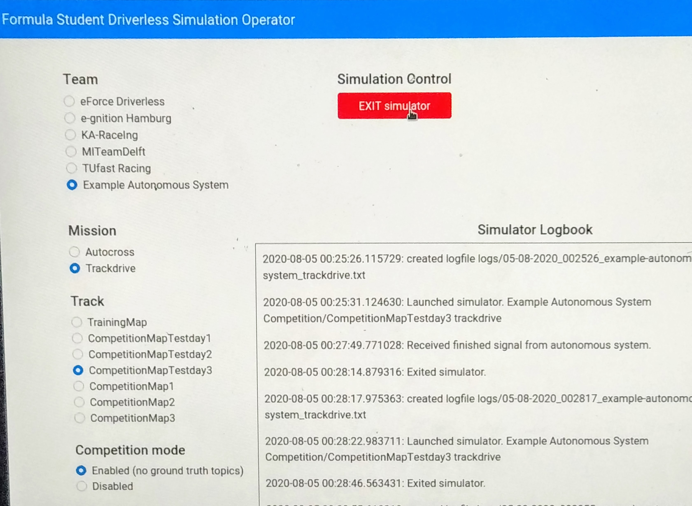

# Operator

The operator offers competition officials a way to control and keep track of what is happening in the simulation
It consists of a webserver with web interface where the official can select a team, missions and track and then launch the simulator.
DOO cones and lap times will be shown and stored on disk. 
The bridge launcher is a helper script to launch the ros bridge on a different computer.
It launches the ros bridge with configuration set in the web interface.

**The operator is primarily used during competition by officials. You don't need this for development and testing.**
Refer to the [getting started guide](getting-started.md) first.




## Team config
The operator uses the `team_config.json` file located in the `/config` folder to load all team specific configuration settings into the simulator. 
This includes the name of each team and their car settings. 
Whenever the simulation is started via the operator's web interface, the selected team's car settings are written to the `settings.json` file located in the main folder of the repository. 
This allows the operator to quickly switch between teams during competition.
Note that the `team_config.json` file included in this repository is an example file.

## Logs
Whenever a mission starts, a log file is created in the `/operator/logs` folder.
All logs received by the webserver will be written to this log file, as long as the mission is ongoing.
Log files are named using the following naming convention: `{datetime}_{team}_{mission}.txt`

## Passwords & Security
To ensure only authorized personal can controll the simulation a password is required for all actions.
This password is configured inside the `operator.py` file in variable `access_token`.
Yes, this is a hard-coded value because I couldn't be bothered doing configuration files for something that changes almost never.
Please change the default value `1234567890` it before running a real competition.

The spectator server should also be protected with a password as described in [the spectator documentation](spectator.md).
The operator writes the spectator password to the settings.json file when the simulation starts so it is not needed to configure the `SpectatorPassword` inside the `team_config.json`. 
Again, this is a hard-coded value in the `operator.py`, default set to `password`.
Please change before competition.

## Running the operator

The operator is built to work on Windows because most likely, the simulation will also run on windows.

To install all python dependencies, run the following command inside the `/operator` folder:
```bash
$ pip install -r requirements.txt
```

Next, download a packaged version of the simulator
Go to the [releases](https://github.com/FS-Driverless/Formula-Student-Driverless-Simulator/releases) and download the latest version.
Extract the zip to the `simulator` folder at the root of this project.
The result should be that the following files and folders exist inside the `simulator` folder:

* FSDS.exe
* FSOnline/
* Engine/

[Here](how-to-release.md) is described how to export the Unreal project.

To start the web server, run the following command in the `operator` folder:
```bash
$ python operator.py
```
By default, the web interface binds to all ip's of the machine on port 5000.

## Running the bridge launcher

The ros bridge will most likely not run on the same computer as the simulator as the ros bridge works best on Ubuntu and the simulator best on Windows.
It is discouraged to run the ros bridge on WSL during competition, see [#199](https://github.com/FS-Driverless/Formula-Student-Driverless-Simulator/issues/199).

To help you quickly start the ros bridge with the configuration parameters set in the operator you can use the bridge launcher.
This script will request the configuration from the operator using an http api call and launch the bridge accordingly.

Before you run it, change the following variables inside the `launchbridge.py` script to reflect your setup:
```
operator_url = "http://10.164.0.3:5000"
operator_token = "1234567890"
```

Next, run the script as follows:

```
eval `./launchbridge.py`
```

**Why eval?** Because I think it is a bad idea to have the ros bridge run as a sub-process of the bridge launcher.
We don't want a problem in the bridge launcher to stop the bridge.
We don't want deal with forwarding logs and signals.
`./launchbridge.py` executes as a whole, outputting bash commands to stdout.
All stdout is interperted as bash commands and executed by eval. 
The rosbridge process is ran _after_ the launchbridge finishes, which is kind-of neat.
I know that this is by no way a perfect solution.
So if you think you can do better I invite you to propose your solution in a github ticket and open a pr.