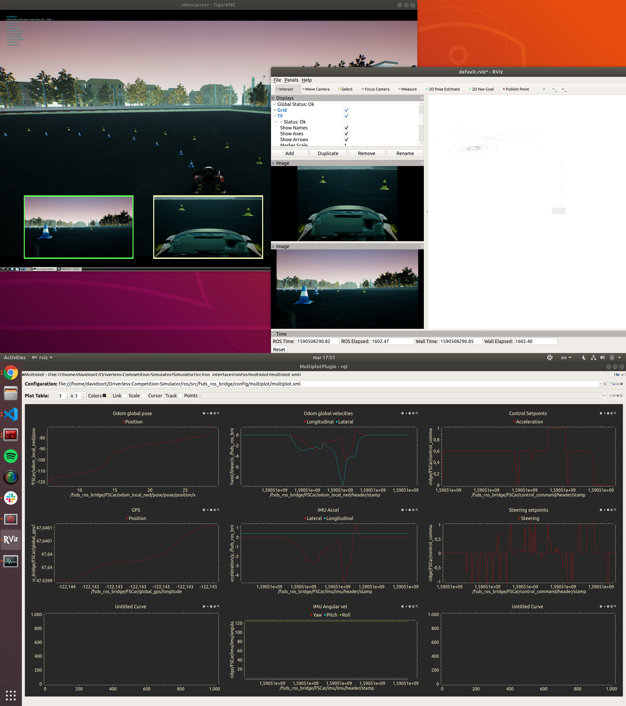

# FSDS Ros bridge



A ROS wrapper over the AirSim C++ **Car** client library. This code is based on the [original AirSim ROS wrapper for the *Multirotor* API](https://github.com/microsoft/AirSim/tree/master/ros/src/airsim_ros_interface) and provides an interface between AirSim + Unreal Engine and your ROS-based autonomous system. 

The fsds_ros_bridge is supposed to be launched pointing at the Autonomous System's ROS master so that it can publish and subscribe to topics within the autonomous system. 
Physically this node should run on the airsim simulation server (that is the one that also runs the Unreal) project.
The node connects to the AirSim plugin, periodically retrieves sensor data (images, lidar, imu, gps) and publishes it on ros topics.
It listens for car setpoints on other another and forwards these to the AirSim plugin.

## Running
Make sure you have [built the ros workspace](building-ros.md).

```
cd ros
source devel/setup.bash
roslaunch fsds_ros_bridge fsds_ros_bridge.launch
```

## Publishers
- `/fsds_ros_bridge/origin_geo_point` [fsds_ros_bridge/GPSYaw](../ros/src/fsds_ros_bridge/msg/GPSYaw.msg)   
GPS coordinates corresponding to global NED frame. This is set in the airsim's [settings.json](https://microsoft.github.io/AirSim/docs/settings/) file under (located [here](../../../UE4Project/Plugins/AirSim/Settings/settings.json)) the `OriginGeopoint` key. 

- `/fsds_ros_bridge/VEHICLE_NAME/global_gps` [sensor_msgs/NavSatFix](https://docs.ros.org/api/sensor_msgs/html/msg/NavSatFix.html)   
This the current GPS coordinates of the drone in airsim. 

- `/fsds_ros_bridge/VEHICLE_NAME/odom_local_ned` [nav_msgs/Odometry](https://docs.ros.org/api/nav_msgs/html/msg/Odometry.html)   
Odometry in NED frame wrt starting point.  THIS WILL NOT BE STREAMED DURING COMPETITION.

- `/fsds_ros_bridge/VEHICLE_NAME/CAMERA_NAME/IMAGE_TYPE/camera_info` [sensor_msgs/CameraInfo](https://docs.ros.org/api/sensor_msgs/html/msg/CameraInfo.html)

- `/fsds_ros_bridge/VEHICLE_NAME/CAMERA_NAME/IMAGE_TYPE` [sensor_msgs/Image](https://docs.ros.org/api/sensor_msgs/html/msg/Image.html)   
  RGB or float image depending on image type requested in [settings.json](../UE4Project/Plugins/AirSim/Settings/settings.json).

- `/tf` [tf2_msgs/TFMessage](https://docs.ros.org/api/tf2_msgs/html/msg/TFMessage.html)

where `VEHICLE_NAME`, `CAMERA_NAME` and `IMAGE_TYPE` are extracted from [settings.json](../UE4Project/Plugins/AirSim/Settings/settings.json).

## Subscribers
- `/fsds_ros_bridge/VEHICLE_NAME/control_command` [fsds_ros_bridge/ControlCommand](../ros/src/fsds_ros_bridge/msg/ControlCommand.msg) 
The contents of this message fill the essential parts of the `msr::airlib::CarApiBase::CarControl` struct. This is the only way to control the car when the airsim ROS client is connected (keyboard will no longer work!).

## Services

- `/fsds_ros_bridge/reset` [fsds_ros_bridge/Reset](../ros/src/fsds_ros_bridge/srv/Empty.html)
 Resets car to start location.

## Parameters
- `/fsds_ros_bridge/update_airsim_control_every_n_sec` [double]   
  Set in: `$(fsds_ros_bridge)/launch/fsds_ros_bridge.launch`   
  Default: 0.01 seconds.    
  Timer callback frequency for updating drone odom and state from airsim, and sending in control commands.    
  The current RPClib interface to unreal engine maxes out at 50 Hz.   
  Timer callbacks in ROS run at maximum rate possible, so it's best to not touch this parameter. 

- `/fsds_ros_bridge/update_airsim_img_response_every_n_sec` [double]   
  Set in: `$(fsds_ros_bridge)/launch/fsds_ros_bridge.launch`   
  Default: 0.01 seconds.    
  Timer callback frequency for receiving images from all cameras in airsim.    
  The speed will depend on number of images requested and their resolution.   
  Timer callbacks in ROS run at maximum rate possible, so it's best to not touch this parameter. 

## Visualization
This package contains some useful launch and config files which will help you in visualizing the data being streamed through the above topics.

To open Rviz with [this](../ros/src/fsds_ros_bridge/config/rviz/default.rviz) configuration file, run `roslaunch fsds_ros_bridge rviz.launch`.

To open Multiplot with [this](../ros/src/fsds_ros_bridge/config/multiplot/multiplot.xml) configuration file, run `roslaunch fsds_ros_bridge plot.launch`

## Monitoring
Performance monitoring of the ROS Bridge is described [here](statistics.md)