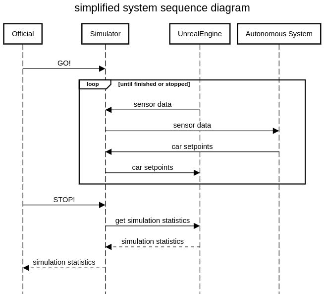

_This document is intended to read top-to-bottom. Do yourself a favour and read the whole thing without skipping ;)_

# Formula Student Driverless Simulation: System overview

FSDS is built around Unreal Engine 4 (the game engine) and the AirSim plugin. 
The game engine does all the graphical rendering, collision simulation and car movement simulation. 
A separate component - the simulator - will handle all control of the simulation, provide external interfaces and store what is happening.

! We will also provide a video feed of the simulation for live streaming purposes.
  Since it is still unclear how this will work this is not included in this description.

## Autonomous systems

Every Autonomous System (AS) will run on its separated environment. 
Ideally, this would be separate virtual machines but also Docker containers could be used.
The ASs are expected to continuously run a ROS master.
When the simulator is ready to do a drive for the given AS it will launch a ROS node connected to this AS's ROS master.
This ROS node will exist outside of the AS's environment. Instead, it will run on the simulator computer.
The simulator ROS node will publish sensor data and listen for car setpoints on a set of topics defined [here](ros-bridge.md).
When the simulation is finished, the ROS node will disconnect from the AS's ROS master and sensor data stops coming in.

During the competition, the teams will not be allowed to access their ASs.
All remote access to the environments will be cut off completely.
So every AS must be able to run multiple missions without human interference.
To let the simulation know what is expected from it, the simulator will send mission control messages a few seconds before the event start.
These messages contain information about the mission (trackdrive, autocross, etc).
When the AS receives a mission message it can expect to receive sensor data shortly after.
Since the lap timer for all events start whenever the car crosses the start-line, the ASs can take all the time they need to launch their relevant algorithms for the mission (within a reasonable time).

## The Operator

The operator is a continuously running program that is like the spider in the web.

The operator offers a web interface to the event's officials. 
Using this web interface the officials can choose which team/car is going to drive and on which track.
The official will also be able to send the start signal, view lap times, down or out cones, car off course's.
There is also an emergency stop button in case the car is uncontrollable.

Only 1 car at the time will be able to run on this AS.
The official can select which team, and thus which AS, is currently selected.
When the team changes, not only the AS but also the car inside the virtual world will change.
The sensor suite (sensor types and locations, defined in a custom `settings.json` file) and the car livery (looks of the car) are updated.
The operator keeps track of these details and passes them along to the virtual world to ensure accurate representation.

When the operator wants to connect an AS to the simulated world, it launches the ros bridge.
Read more about the ros bridge below.
If the operator wants to disconnect the AS from the simulated world it stops the bridge node and the connections are stopped.

During a mission, the operator keeps polling the world for 'referee state'.
This is information that in a physical world would be relevant to the referee.
Currently, this includes a list of down or out cones and the timestamp of when they went down or out, a list of lap times and a list of when the car went off-track.
More information will for sure be added.

What happens inside the simulation is stored in a single logbook.
This includes all referee updates, which ASs were selected and which tracks were used.
If something unexpected went wrong like a system's crash or error, a short description of what happened is included in this logbook.
It gives a timeline of everything that happened to always go back afterwards and check what happened.
The logbook is stored on disk so that in the event of a whole system crash we will still have the logbook.
It is also shown within the referee's web interface.

## The ROS Bridge
The ros bridge node connects to the simulated world inside Unreal Engine using AirSim (more on that later).
On the one hand, it requests sensor data and passes it along on ROS topics to the current AS.
On the other hand, it receives car control commands from the AS and forwards it to the virtual world.
So it acts as a bridge between the two.

The node that is launched pointing at the AS's ROS master so that it can publish and subscribe to topics within the AS.
Physically this node runs on the server where the Unreal world is being simulated.
The node is launched by the operator.

When the operator launches the ros bridge it passes along some mission variables.
This includes mission type (trackdrive or autocross) and information about how it can use data collected in previous runs.
For example, first the AS will receive "autocross on track A" and it knows it cannot use any previous collected information.
Then it receives "trackdrive on track A" and it knows it can use data collected in the first autocross drive to go faster.

It is the responsibilty of the teams to detect when they are 'done'. 
After the required number of laps, the car has to come to a full stop.
If the AS wants to store things (like track information), this is the time to wrap those up.
In case of a successfull run the official will instruct the operator to stop the ros bridge and the AS won't receive sensor data anymore.
When the official presses the emergency brake, the connection between the ros bridge is stopped immediately and the operator will send one last car setpoint to make the car come to a stop. 
Thers is no 'stop' signal from the simulator to the AS.
We advise AS to get ready for a new drive when no sensor data is received for 2 seconds.

At this point only ros is supported, at this moment there are no plans to support other technologies.

## The virtual world (Unreal Engine and AirSim)

The actual simulation takes place inside an Unreal Engine 4 world.
Unreal takes care of the heavy lifting involved with a real-life simulation.
All physics, lighting and world-building are handled by Unreal.

AirSim is used to connect Unreal with the operator and ros bridge.
This plugin is added inside the Unreal world and takes control of most of the game logic.
It receives the sensor suite and simulates the sensors, it moves the car according to trajectory setpoints and exposes an RPC API for external management.
This RPC API is used by the simulator to interact with the world.
