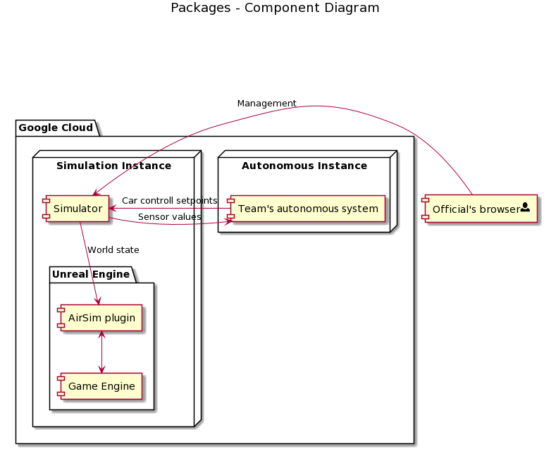

_This document is intended to read top-to-bottom. Do yourself a favour and read the whole thing without skipping ;)_

# Formula Student Driverless Simulation: System overview

FSDS is built around Unreal Engine 4 (the game engine) and the AirSim plugin. 
The game engine does all the graphical rendering, collision simulation and car movement simulation. 
A separate component - the simulator - will handle all control of the simulation, provide external interfaces and store what is happening.

! We will also provide a video feed of the simulation for live streaming purposes.
  Since it is still unclear how this will work this is not included in this description.

## Autonomous Systems.

Every autonomous system runs on its own separated environment. 
Idealy this would be separate virtual machines but also Docker containers could be used.
The autonomous systems are expected to continuously run a ROS master.
When the simulator is ready to do a drive for the given autonomous system, the simulator will launch a ROS node connected to this autonomous system's ROS master.
This ROS node will exist outside of the autonomous system's environment, instead it will run on the simulator computer.
The simulator ROS node will publish sensor data and listen for car setpoints on a set of topics defined [here](airsim-ros-wrapper.md).
When the simulation is finished, the ROS node will disconnect from the autonomous system's ROS master and sensor data is no longer streaming.

During the competition the teams will not be allowed to access their autonomous systems.
All remote access to the environments will be cut off completely.
So every autonomous system must be able to run multiple missions without human interferance.
To let the simulation know what is expected from it, the simulator will send mission control messages a few seconds before the event start.
These messages contain information about the mission (trackdrive, autocross, etc).
When the autonomous system receives a mission message it can expect to receive sensor data shortly after.
Since the laptimer for all events start whenever the car crosses the start-line, the autonomous system's can take all the time they need to launch their relevant algorithms for the mission (within reasonable time).

## The Simulator

The simulator is a continuously running program that is like the spider in the web.

The simulator offers a web interface to the event's officials. 
Using this web interface the officials can choose what team/car is going to drive and which track is going to be used.
The official will also be able to send the start signal, view lap times, down or out cones, car off course's.
There is also an emergency stop button in case the car is uncontrollable.

The simulator connects to the simulated world inside Unreal Engine using AirSim (more on that later).
It also connects to the autonomous systems and acts like a bridge between the two.
On the one hand it requests sensor data and passes it along on ROS topics to the current autonomous system.
On the other hand it receives car control commands from the autonomous system and forwards it to the virtual world.

Only 1 car will be able to run on this autonomous system.
The official can select what team, and thus what autonomous system, is currently selected.
When the team changes not only the autonomous system, but also the car inside the virtual world changes.
The sensor suite (sensor types and locations, defined in a custom `settings.json` file) and the car livery (looks of the car) are updated.
The simulator keeps track of these details and passes them along to the virtual world to ensure accurate representation.

When a start signal is received the simulator informs the current autonomous system of the mission and starts sending sensor data its way.
When a stop signal is received, the simulator stops interacting with the attached autonomous system and informs the virtual world that the car must stop driving

During a mission the simulator keeps polling the world for 'referee state'. 
This is information that in a physical world would be relevant to the referee.
Currently this includes a list of down or out cones and the timestamp of when they went down or out, a list of laptimes and a list of when the car went off-track.
More information will for sure be added.

A single logbook will store what happened inside the simulation.
This includes all referee updates, what autonomous systems were selected and what tracks were used.
If something unexpectedly went wrong like a system's crash or error, a short description of what happened is included in this logbook.
It gives a timeline of everything that happened to always go back afterwards and check what happened.
The logbook is stored on disk so that even when the whole system crashes we always have the logbook.
It is also shown within the referee's web interface.

## The virtual world (Unreal Engine and AirSim)

The actual simulation takes place inside an Unreal Engine 4 world.
Unreal takes care of the heavy lifting involved with a real-life simulation.
All phisics, lighting and world building are handled by Unreal.

AirSim is used to connect Unreal with the Simulator.
This plugin is added inside the Unreal world and takes control of most of the game logic.
It receives the sensor suite and simulates the sensors, it moves the car according to trajectory setpoints and exposes an api for external management.
This rpc api is used by the simulator to interact with the world.

