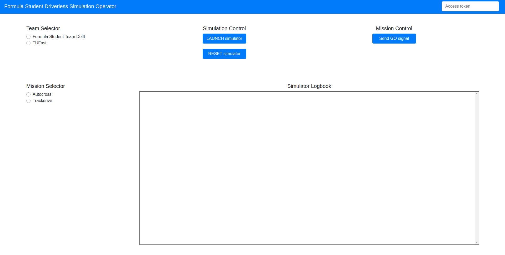

# Operator
This folder contains the operator of the simulation. The operator consists of both a web interface and a webserver. The operator is meant to be used by Formula Student officials to control and keep track of what is happening in the simulation. From this web interface, the official can select teams and events, start, stop and reset the car and view all logs received by the webserver. All these logs are also stored in log files, in the case that the operator crashes.



## Prerequisites
+ [Flask](https://flask.palletsprojects.com/en/1.1.x/) - A Python web application framework.

To install all dependencies, run the following command:
```bash
$ pip install -r requirements.txt
```

## Usage
To start the web server, run the following command in this folder:
```bash
$ python webserver.py
```
By default, the web interface runs on `http://localhost:5000`.
