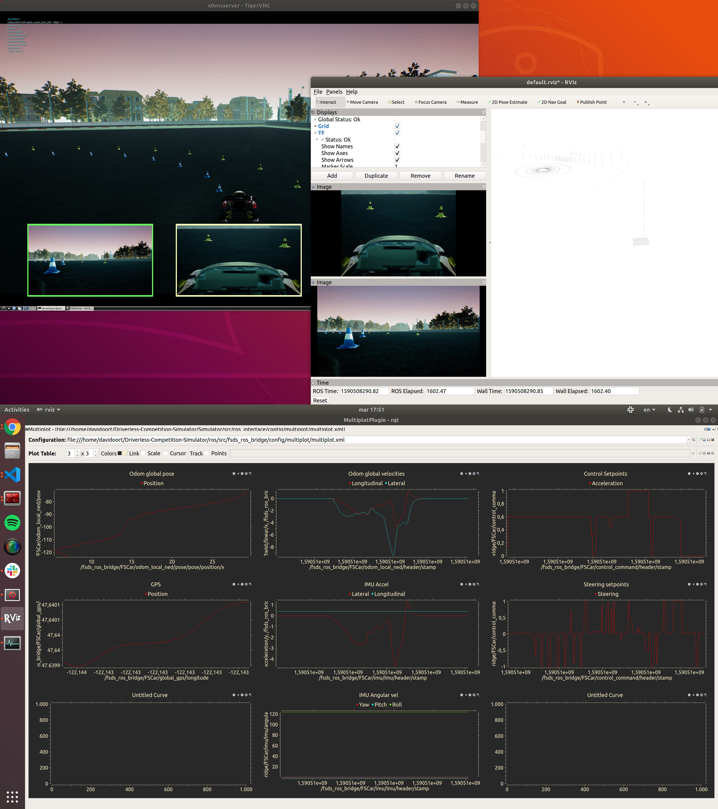

This is a [ROS Catkin workspace](http://wiki.ros.org/catkin/workspaces). To build it, read [building-ros.md](../docs/building-ros.md`).

This workspace has the following packages:
* fsds_ros_bridge: a node that can connect an autonomous system to the Unreal world. [Read more](../docs/ros-bridge.md)
* joystick: a node that takes xbox controller commands and translates them into simulation car setpoints. [Read more](../docs/joystick.md)
